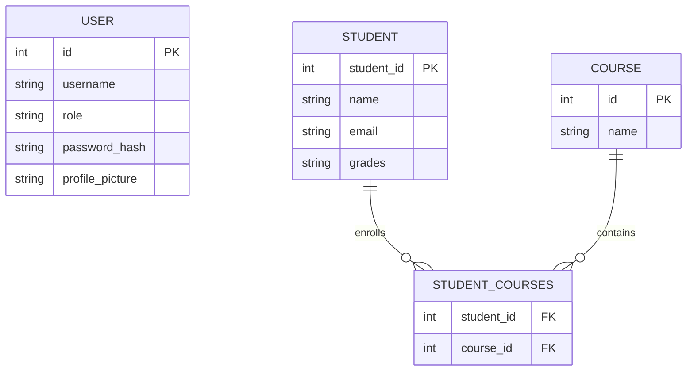

# Flask Student Management Dashboard

A full-featured Flask web application for managing users, students, courses, enrollments, grades, and profile pictures through both HTML pages and REST API endpoints.

The project uses Flask Blueprints, SQLAlchemy, Flask-Login, Flask-WTF, database migrations, automated testing, CI/CD, Bootstrap 5, JavaScript Fetch API search, and PostgreSQL deployment on Render.

---

## Live Application

The application is deployed on Render.

```text
https://flask-phase-project.onrender.com/```


---

## Features

### Authentication

* User registration
* Login and logout
* Password hashing using Werkzeug
* Session management using Flask-Login
* Authentication-protected management pages
* Flask-WTF form validation
* CSRF protection for HTML forms

### Student Management

* Create students
* View all students
* View individual student details
* Edit students
* Delete students
* Store student grades
* Calculate grade averages
* Search students
* Database-backed pagination
* Live student search using JavaScript and the Fetch API

### Course Management

* Create courses
* View all courses
* View individual course details
* Edit courses
* Delete courses
* Search courses
* Database-backed pagination
* View students enrolled in each course

### Enrollment

Students and courses have a many-to-many relationship.

The application supports:

* Enrolling a student in a course
* Unenrolling a student from a course
* Listing a student's enrolled courses
* Preventing duplicate enrollment
* Cascading deletion of association records when a student or course is removed

### Profile Pictures

Users can upload profile pictures.

Upload handling includes:

* JPG
* JPEG
* PNG
* GIF
* WEBP
* Maximum upload size validation
* Secure generated filenames
* Profile-picture path stored in the database
* Existing profile image cleanup when replaced

### REST API

REST endpoints are available for:

* Students
* Courses
* Users
* Student-course enrollment

The API provides JSON responses with appropriate HTTP status codes and error messages.

### Error Handling

Custom application-level error handling is provided for:

* `404 Not Found`
* `500 Internal Server Error`

Production error pages do not expose internal exception details.

### Frontend

The interface uses:

* Bootstrap 5
* Jinja2 template inheritance
* Reusable Jinja macros
* Responsive navigation
* Styled tables and forms
* Flash messages
* Pagination controls
* Dynamic student search with the Fetch API

### Testing and CI

The project uses:

* Pytest
* Flask test client
* pytest-cov
* Black
* Flake8
* GitHub Actions

The current automated suite contains **33 tests** with approximately **82% application coverage**.

GitHub Actions automatically checks:

1. Dependency installation
2. Black formatting
3. Flake8 linting
4. Pytest
5. Minimum 80% test coverage

---

# Technology Stack

## Backend

* Python 3.14
* Flask
* Flask-SQLAlchemy
* Flask-Migrate
* Flask-Login
* Flask-WTF
* WTForms
* Werkzeug

## Database

### Development

* SQLite

### Production

* PostgreSQL
* psycopg

## Frontend

* HTML5
* Bootstrap 5
* Jinja2
* JavaScript
* Fetch API

## Testing and Quality

* Pytest
* pytest-cov
* Black
* Flake8

## Deployment

* Render Web Service
* Render PostgreSQL
* Gunicorn
* GitHub Actions

---

# Project Structure

```text
flask-phase-project/
├── .github/
│   └── workflows/
│       └── python-app.yml
│
├── app/
│   ├── forms/
│   │   ├── __init__.py
│   │   ├── auth.py
│   │   └── user.py
│   │
│   ├── models/
│   │   ├── __init__.py
│   │   ├── association.py
│   │   ├── course.py
│   │   ├── student.py
│   │   └── user.py
│   │
│   ├── routes/
│   │   ├── __init__.py
│   │   ├── api.py
│   │   ├── auth.py
│   │   ├── courses.py
│   │   ├── students.py
│   │   └── users.py
│   │
│   ├── static/
│   │   ├── css/
│   │   │   └── style.css
│   │   └── uploads/
│   │       └── profiles/
│   │
│   ├── templates/
│   │   ├── macros/
│   │   │   └── pagination.html
│   │   ├── add_course.html
│   │   ├── auth_register.html
│   │   ├── base.html
│   │   ├── course_detail.html
│   │   ├── courses.html
│   │   ├── dashboard.html
│   │   ├── edit_course.html
│   │   ├── edit_student.html
│   │   ├── edit_user.html
│   │   ├── index.html
│   │   ├── internal_server_error.html
│   │   ├── login.html
│   │   ├── not_found.html
│   │   ├── register.html
│   │   ├── student_detail.html
│   │   ├── students.html
│   │   ├── user_detail.html
│   │   └── users.html
│   │
│   ├── utils/
│   │   ├── __init__.py
│   │   └── uploads.py
│   │
│   ├── __init__.py
│   ├── config.py
│   └── extensions.py
│
├── migrations/
│   └── versions/
│
├── tests/
│   ├── conftest.py
│   ├── test_advanced_features.py
│   ├── test_api.py
│   ├── test_auth.py
│   ├── test_courses_extra.py
│   ├── test_relationships.py
│   └── test_web_crud.py
│
├── .env.example
├── .flake8
├── .gitignore
├── .python-version
├── requirements.txt
├── run.py
├── seed.py
└── README.md
```

---

# Database Schema

The application contains three main models and a many-to-many association table.



---

# Models

## User

Represents an authenticated application user.

Main fields:

* `id`
* `username`
* `password_hash`
* `profile_picture`

Passwords are never stored directly. Werkzeug generates and verifies password hashes.

The `profile_picture` field contains the relative path to an uploaded image rather than storing image data inside the database.

The `role` field controls application permissions and supports:

- `admin`
- `instructor`
- `student`

---

## Student

Represents a student.

Main fields:

* `student_id`
* `name`
* `email`
* `grades`

The model also provides:

* Grade parsing
* Average calculation
* Course relationship

A student can enroll in multiple courses.

---

## Course

Represents an available course.

Main fields:

* `id`
* `name`

A course can contain multiple students.

---

## Student-Course Relationship

`Student` and `Course` use a many-to-many relationship through the `student_courses` association table.

```text
Student
   │
   │ many
   ▼
student_courses
   ▲
   │ many
   │
Course
```

The association foreign keys use:

```text
ON DELETE CASCADE
```

Therefore deleting a student or course removes its associated enrollment records without deleting the entity on the opposite side.

---

# Local Setup

## 1. Clone the Repository

```bash
git clone https://github.com/AbdAlruhman-Atout/flask-phase-project.git
cd flask-phase-project
```

## 2. Create a Virtual Environment

```bash
python3 -m venv .venv
```

Activate it on Linux/macOS:

```bash
source .venv/bin/activate
```

On Windows:

```text
.venv\Scripts\activate
```

## 3. Install Dependencies

```bash
python -m pip install -r requirements.txt
```

## 4. Create the Environment File

```bash
cp .env.example .env
```

Example development configuration:

```env
SECRET_KEY=change-me
DATABASE_URL=sqlite:///students.db
FLASK_DEBUG=1
```

Use a strong random `SECRET_KEY` outside local development.

---

# Database Setup

Apply all migrations:

```bash
python -m flask --app run.py db upgrade
```

Flask-Migrate and Alembic manage database schema changes.

---

# Running Locally

```bash
python run.py
```

Open:

```text
http://127.0.0.1:5000
```

---

# Authentication Routes

```text
GET/POST  /register
GET/POST  /login
GET       /logout
GET       /dashboard
```

---

# Student HTML Routes

```text
GET       /students
GET/POST  /students/register
GET       /students/<student_id>
GET/POST  /students/<student_id>/edit
POST      /students/<student_id>/delete
POST      /students/<student_id>/enroll
```

Search:

```text
/students?search=alice
```

Pagination:

```text
/students?page=2
```

Custom page size:

```text
/students?page=2&per_page=5
```

Combined:

```text
/students?search=alice&page=1&per_page=10
```

---

# Course HTML Routes

```text
GET       /courses
GET       /courses/<course_id>
GET/POST  /courses/add
GET/POST  /courses/<course_id>/edit
POST      /courses/<course_id>/delete
```

Filtering:

```text
/courses?search=python
```

Pagination:

```text
/courses?page=2
```

Combined:

```text
/courses?search=python&page=1&per_page=10
```

---

# User HTML Routes

```text
GET       /users
GET       /users/<user_id>
GET/POST  /users/<user_id>/edit
POST      /users/<user_id>/delete
```

The edit route also supports profile-picture upload.

---

# REST API

The REST API uses the `/api` prefix.

## Student API

```http
GET     /api/students
GET     /api/students/<student_id>
POST    /api/students
PUT     /api/students/<student_id>
DELETE  /api/students/<student_id>
```

Live search:

```http
GET /api/students?search=alice
```

Example create request:

```json
{
  "student_id": 1001,
  "name": "Alice",
  "email": "alice@example.com",
  "grades": [90, 85, 78]
}
```

Example response:

```json
{
  "student_id": 1001,
  "name": "Alice",
  "email": "alice@example.com",
  "grades": [90.0, 85.0, 78.0],
  "average": 84.33,
  "courses": []
}
```

---

# Course API

```http
GET     /api/courses
GET     /api/courses/<course_id>
POST    /api/courses
PUT     /api/courses/<course_id>
DELETE  /api/courses/<course_id>
```

Example:

```json
{
  "name": "Digital Design"
}
```

---

# Enrollment API

Enroll:

```http
POST /api/students/<student_id>/courses/<course_id>
```

Successful enrollment:

```text
201 Created
```

Duplicate enrollment:

```text
409 Conflict
```

Unenroll:

```http
DELETE /api/students/<student_id>/courses/<course_id>
```

Successful unenrollment:

```text
204 No Content
```

List enrolled courses:

```http
GET /api/students/<student_id>/courses
```

---

# User API

```http
GET     /api/users
GET     /api/users/<user_id>
POST    /api/users
PUT     /api/users/<user_id>
DELETE  /api/users/<user_id>
```

Example create request:

```json
{
  "username": "admin",
  "password": "password123"
}
```

User API responses never expose `password_hash`.

Example response:

```json
{
  "id": 1,
  "username": "admin",
  "profile_picture": "uploads/profiles/example.png"
}
```

---

# HTTP Status Codes

| Status | Meaning                                  |
| ------ | ---------------------------------------- |
| `200`  | Request successful                       |
| `201`  | Resource created                         |
| `204`  | Successful request with no response body |
| `400`  | Invalid request                          |
| `404`  | Resource not found                       |
| `409`  | Conflict                                 |
| `500`  | Internal server error                    |

Example API error:

```json
{
  "error": "not_found",
  "message": "Student not found."
}
```

---

# CSRF Protection

Flask-WTF provides CSRF protection for browser forms.

State-changing HTML forms include a CSRF token.

The JSON REST API is exempt from Flask-WTF CSRF handling because API clients do not use the browser-form CSRF workflow.

---

# Profile Picture Uploads

Supported extensions:

```text
jpg
jpeg
png
gif
webp
```

Maximum application request size:

```text
3 MB
```

Profile-picture form limit:

```text
2 MB
```

Uploaded files are stored under:

```text
app/static/uploads/profiles/
```

The database stores only the relative path.

Generated UUID-based filenames reduce filename collisions.

---

# Important Deployment Note About Uploaded Files

The current application stores uploaded profile pictures on the web service filesystem.

Render web-service filesystems may be ephemeral depending on the hosting configuration. Uploaded profile pictures can therefore be lost after redeployment or instance replacement even though their database paths remain.

A production extension could use:

* Render persistent disk
* Cloudinary
* Amazon S3
* Another object-storage provider

Database records themselves are stored in persistent PostgreSQL.

---

# Testing

Run:

```bash
python -m pytest -q
```

Current suite:

```text
33 tests
```

Tests cover:

* Registration
* Login
* Logout
* Authentication protection
* Student CRUD
* Course CRUD
* User management
* Student API
* Course API
* User API
* Enrollment
* Unenrollment
* Duplicate enrollment
* Many-to-many relationships
* Cascade deletion
* Search
* Pagination
* Profile-picture uploads
* Upload validation
* Custom 404 behavior
* Request validation
* API error handling

---

# Coverage

```bash
python -m pytest \
    --cov=app \
    --cov-report=term-missing \
    --cov-fail-under=80
```

Current application coverage is approximately:

```text
82%
```

CI fails if coverage drops below:

```text
80%
```

---

# Code Formatting

Check Black formatting:

```bash
black --check app tests run.py seed.py
```

Automatically format:

```bash
black app tests run.py seed.py
```

---

# Linting

```bash
flake8 app tests run.py seed.py
```

A successful run produces no lint errors.

---

# Continuous Integration

Workflow:

```text
.github/workflows/python-app.yml
```

CI runs automatically on pushes and pull requests.

```text
Checkout repository
        ↓
Set up Python
        ↓
Install dependencies
        ↓
Black formatting check
        ↓
Flake8 lint check
        ↓
Pytest + coverage
        ↓
Require >= 80% coverage
```

---

# Production Deployment

The production application uses Render.

## Architecture

```text
GitHub Repository
        │
        ▼
Render Web Service
        │
        ├── Gunicorn
        │
        └── Flask
                │
                ▼
        Render PostgreSQL
```

## Production Start Command

```bash
python -m flask --app run.py db upgrade && gunicorn run:app
```

This applies pending database migrations before starting Gunicorn.

## Production Environment Variables

```text
SECRET_KEY=<strong-random-secret>
DATABASE_URL=<render-postgresql-internal-url>
FLASK_DEBUG=0
```

Secrets and database credentials are configured through Render and are never committed to GitHub.

---

# Development vs Production

## Development

```text
Server: Flask development server
Database: SQLite
Debug: Optional
```

Example:

```env
DATABASE_URL=sqlite:///students.db
FLASK_DEBUG=1
```

## Production

```text
Server: Gunicorn
Database: PostgreSQL
Debug: Disabled
```

---

# Database Migrations

Create a migration:

```bash
python -m flask --app run.py db migrate -m "describe change"
```

Apply migrations:

```bash
python -m flask --app run.py db upgrade
```

Current revision:

```bash
python -m flask --app run.py db current
```

---

# Security Features

The application includes:

* Werkzeug password hashing
* Password hashes excluded from API responses
* Flask-Login session management
* Authentication-required management pages
* CSRF protection for HTML forms
* File-extension validation
* File-size validation
* Secure upload filenames
* Environment-variable configuration
* Production debug mode disabled
* Generic production 500 error page
* Database credentials excluded from source control

---

# Future Improvements

Possible improvements include:

* Role-based authorization for Admin, Instructor, and Student users
* Cloud-based profile-picture storage
* API authentication
* Rate limiting
* Email verification
* Password-reset workflow
* Docker support
* More detailed audit logging
* Expanded API pagination
* PostgreSQL-backed development environment
* Dedicated REST framework or API schema documentation

---

# Repository

GitHub:

```text
https://github.com/AbdAlruhman-Atout/flask-phase-project
```

---

# License

This project was developed as a Flask capstone training project.

---

# Author

**AbdAlruhman Atout**
